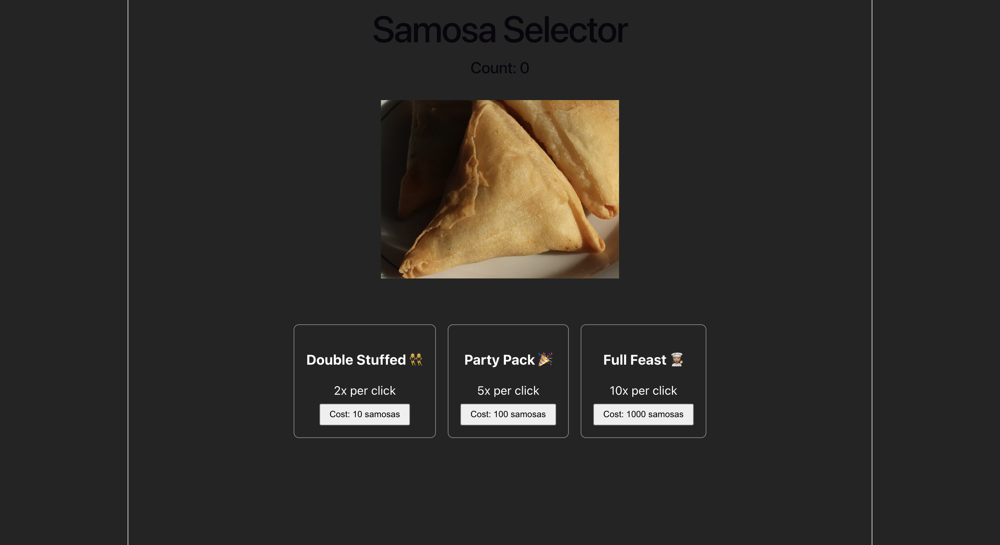
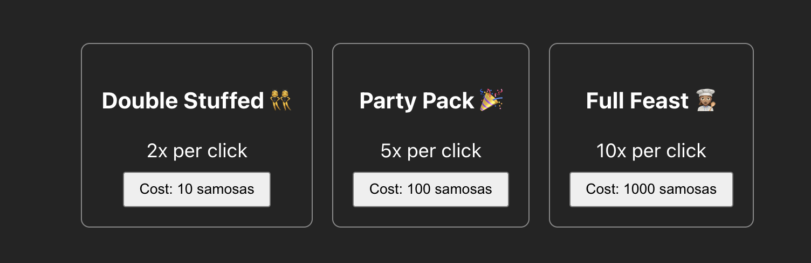

# Samosa Selector

An incremental clicker game built with React and Vite, inspired by Cookie Clicker. Click the Big Samosa to rack up samosas, then spend them on upgrades that multiply every click.

Built for CodePath WEB 102, Unit 2 Lab.

## Features

### Required
- A large samosa you can click to harvest one samosa at a time
- A counter showing how many samosas you currently have
- Three upgrades that boost samosas per click at set thresholds:

  | Upgrade | Effect | Cost |
  | --- | --- | --- |
  | Double Stuffed 👯‍♀️ | 2x per click | 10 samosas |
  | Party Pack 🎉 | 5x per click | 100 samosas |
  | Full Feast 👩🏽‍🍳 | 10x per click | 1000 samosas |

### Stretch
- Buying an upgrade subtracts its cost from your total
- A pulse effect that grows the samosa on hover and shrinks it on click

## Walkthrough

Each step below includes a caption describing what the demo shows, since the video clips have no audio.

### Step 1 — The interface



> Here's the game: a title ("Samosa Selector"), a live counter showing "Count: 0", a clickable samosa image, and the three upgrade cards below.

### Step 2 — Clicking to earn (the counter)

https://github.com/user-attachments/assets/f1931feb-62e6-42e7-a10b-3d057d5b4e1f

> Clicking the samosa several times. Each click adds one samosa, so the count rises by 1 every time.

### Step 3 — The upgrades



> The three upgrade cards — Double Stuffed, Party Pack, and Full Feast — each showing its description (2x / 5x / 10x per click) and its cost (10 / 100 / 1000 samosas).

### Steps 4 & 5 — Buying an upgrade (multiplier + cost deduction)

https://github.com/user-attachments/assets/ddf21b1d-7a60-45d6-91c6-4dfe2a379b59

> I click the samosa until I have at least 10, then buy Double Stuffed. Notice two things: the count drops by 10 (the upgrade's cost is deducted), and from now on every click is worth 2 instead of 1, so the count climbs faster.

### Step 6 — Pulse effect

https://github.com/user-attachments/assets/01322bff-dde6-4b2c-bb92-8f378b845a6b

> Hovering over the samosa makes it grow, and clicking (holding down) makes it shrink — a pulse effect done entirely in CSS.

## What I practiced
- Creating state variables with the `useState` hook (`count` and `multiplier`)
- Registering `onClick` events on the samosa image and upgrade buttons
- Defining event-handler functions to update state

## Running locally

```bash
npm install
npm run dev
```

Then open the `http://localhost:5173/` link that Vite prints.

## Tech stack
- React 18
- Vite
